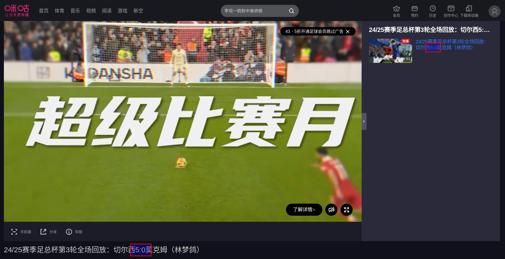
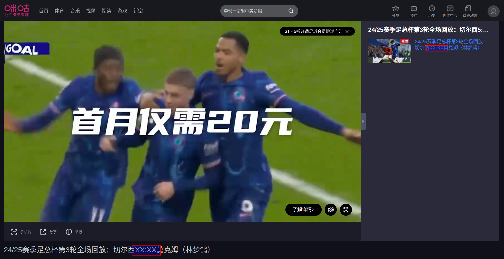
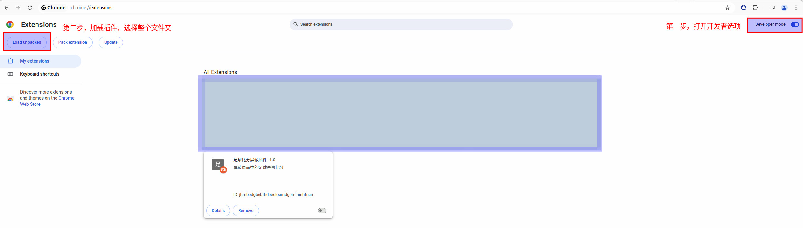
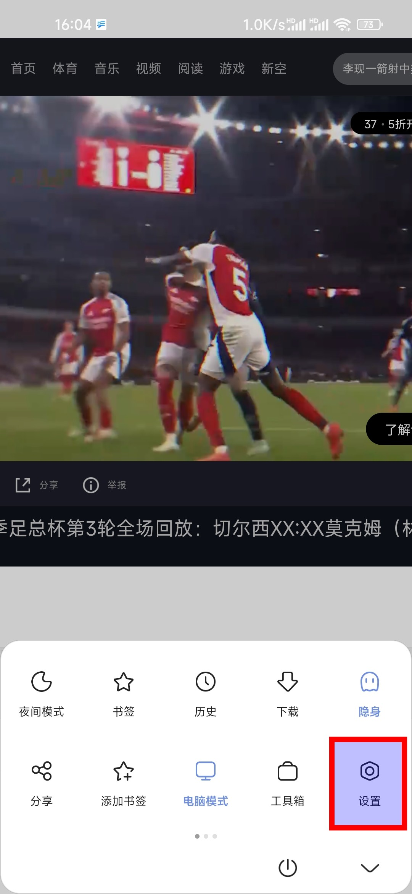
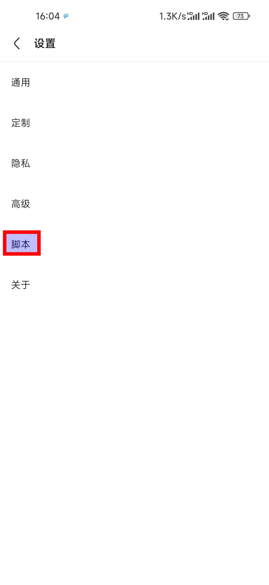
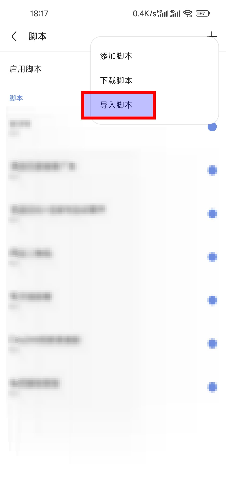
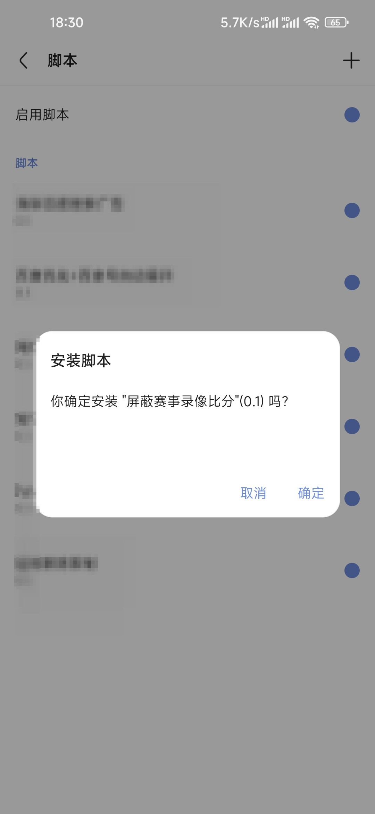

# HideScore

屏蔽掉赛事（足球、篮球）录像页面（咪咕、腾讯）比分的脚本插件 ～～～ 

Chrome、Via 可用 🤗🤗🤗 

使用前：

使用后：

## 使用方法

### Chrome

1. 打开 chrome://extensions/
2. 打开 `Developer mode`
3. 加载插件 `load unpacked`，选择整个文件夹

### Via

1. 打开设置

2. 选择 `脚本`

3. 选择 `导入脚本` ，浏览手机文件，选择 `content_via.js`

4. 确认安装

## 注意

目前只测试了咪咕、腾讯的录像比分页面。

Via 使用的时候需要使用 `电脑模式`

🤗🤗🤗

## 目前已知问题

- Via 中腾讯视频页面不起作用